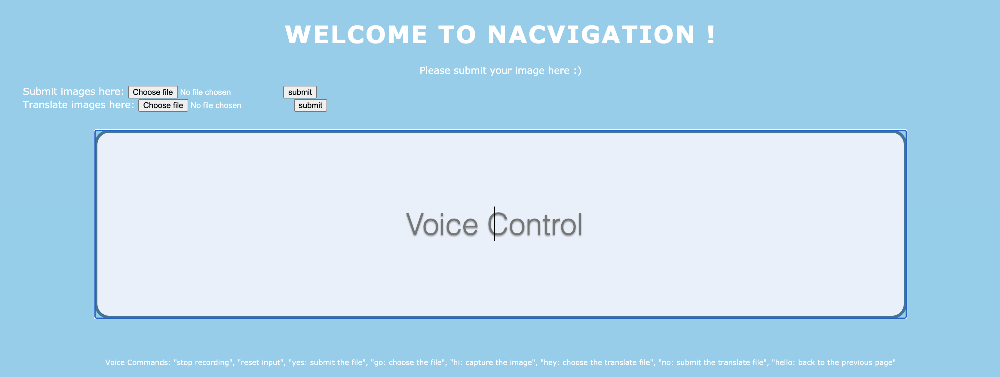

# Orbital_naCVigation

naCVigation is a web app that is designed specially for visually impaired people.

## Motivation

To help those visually impaired people to easily access information as they rely mainly on their hearing to obtain information especially when braille is not available.
 
 
Moreover, sometimes textual information is stored inside pictures and thus this information is not easily accessible, so we want to extract out the important information from the pictures and make it accessible for the visually impaired people as well as the non-visually impaired people for their own purposes.

## Aim

We wish to develop a tool using image recognition and text-to-speech tools to help the visually impaired people in their daily life. For the non-visually impaired people, this tool can help in extraction of text from images and make this process more convenient.

## How are we different from other platforms

1. Some translation apps, such as Youdao Dictionary and PowerWord, may have similar
functions. For example, they have the options to take pictures or upload photos so as to
translate the words in the pictures or photos from one language to another. However,
they do not have the option of speaking out as well as lack the voice control mechanism,
which is not user-friendly to visually impaired people.
 
 
2. Some websites, such as Baidu may have the ability to extract the text from the photos,
but they do not have the features of translating the text and speaking out the text all
together.

## Links to other documents

[*Developer Guide*](https://github.com/BILLXYR/Orbital_naCVigation/blob/main/doc/Developer%20Guide.md)
 
[*User Guide*](https://github.com/BILLXYR/Orbital_naCVigation/blob/main/doc/User%20Guide.md)
