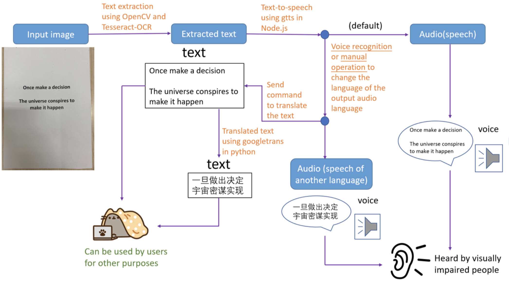
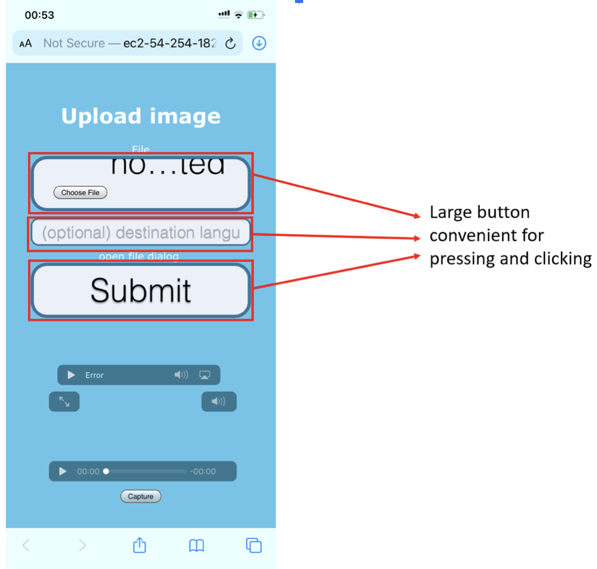
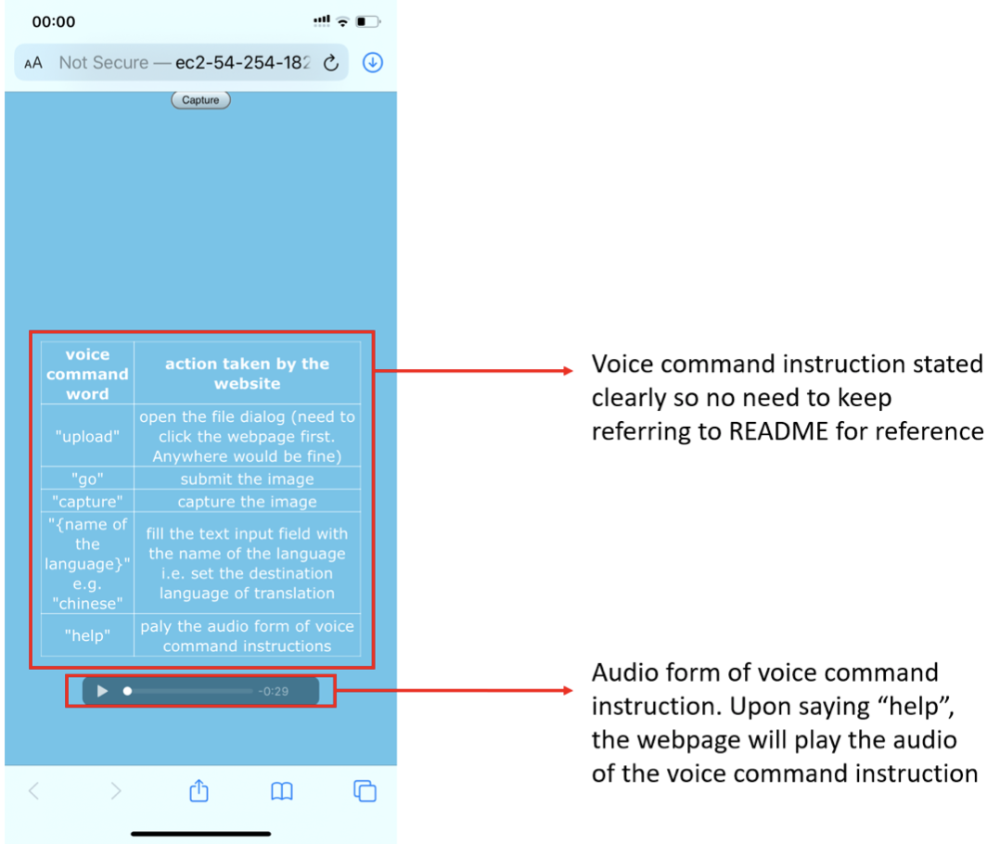

# Orbital_naCVigation

---
layout: page
title: Developer Guide
---
* Table of Contents
    * [1. Overview](#1-overview)
        * [1.1 Introduction](#11-introduction)
        * [1.2 Setting Up, Getting Started](#12-setting-up-getting-started)
    * [2. Design](#2-design)
        * [2.1 Program Flow](#21-program-flow)
        * [2.2 Design of Web Page](#22-design-of-web-page)
    * [3. Implementation](#3-implementation)
        * [3.1 Framework](#31-framework)
        * [3.2 Frontend](#32-frontend)
        * [3.3 Backend](#33-backend)
        * [3.4 Voice command](#34-voice-command)
    * [4. Software Engineering Process](#4-software-engineering-process)
        * [4.1 Understanding Customer Requirements](#31-framework)
        * [4.2 Requirement Analysis: Is the Project Feasible](#32-frontend)
        * [4.3 Creating a Design](#33-backend)
        * [4.4 Coding, Testing, and Installation](#34-voice-command)
        * [4.5 Keeping it Going: Maintenance](#34-voice-command)
    * [5. Software Engineering practices](#5-software-engineering-practices)
        * [5.1 Planning ](#51-planning)
        * [5.2 Prototyping](#52-prototyping)
        * [5.3 Version control](#53-version-control)
    

--------------------------------------------------------------------------------------------------------------------

## 1. **Overview**
Welcome to naCVigation Developer Guide. This documentation provides you an insight on how UniSave is designed and implemented.

## 1.1 Introduction
naCVigation is a **web app designed specifically for visually impaired people**

It is an application that helps visually impaired people to manage their daily activities with various functions, such as translating the text and voice out features.

 
## 1.2 Setting Up, Getting Started
Refer to the guide [_Setting up and getting started_](SettingUp.md).

--------------------------------------------------------------------------------------------------------------------

## 2. **Design**

### 2.1 Program Flow

### 2.2 Design of Web Page

--------------------------------------------------------------------------------------------------------------------

## 3. **Implementation**

This section describes some noteworthy details on how certain features are implemented.

### 3.1 Framework
Express in Node.js is used as the framework for this web application as this is a fast and clean framework for Node.js. 

### 3.2 Frontend
EJS is used as it is a relatively effective and simple templating language to generate HTML markup with plain JavaScript.

### 3.3 Backend

#### 3.3.1 Uploading and storage:
Multer in Node.js is used. As this web application has no need to store images or any other forms of data, the use of a database would be relatively irrelevant. Instead, Multer is used in Node.js to handle the uploading images by the users.
#### 3.3.2 Data processing by python:
Python is run as a child process from the main Node.js application for image processing, text extraction and translation. The result of the child process of python will be received and processed by the main Node.js application.

**Image processing**
OpenCV is used. As OpenCV is a very powerful and highly optimised open-sourced image processing library for real-time applications, it is used in this web application to process uploaded images before sending for text extraction.

**Text extraction**

Tesseract-OCR together with pytesseract are used. As Tesseract-OCR is an open-sourced and very effective optical character recognition tool, it is used in the text extraction stage in this web application. We have also tried Tesseract.js, an OCR package for Node.js which is entirely written in JavaScript. However, in comparison to Tesseract-OCR, Tesseract-OCR has a far much better performance than Tesseract.js. Hence, Tesseract-OCR was chosen.

**Translation**

A python library, “googletrans”, is used to handle the translation as requested by the users. This library supports a wide range of languages and it has a better translation result as compared to other libraries.

#### 3.3.3 text-to-speech:
gTTS(Google text to speech) in Node.js is used as text-to-speech tools to convert text to audio which can be then played and heard by users, as gTTS is one of the most useful and reliable text-to-speech packages in Node.js.

### 3.4 Voice command
SpeechRecognition object and the webkitSpeechRecognition object in the browser are used to construct the voice command mechanism. As the user speaks to the microphone of their devices, sentences or words will be recorded down and the recorded sentences or words will be processed by JavaScript script in the web page and the result will be sent to the main Node.js application.

## 4. **Software Engineering Process**

### 4.1 Understanding Customer Requirements
Our target groups are mainly visually impaired people with a minor target group of those who need the extraction of images and translation of the texts extracted.

For the visually impaired group, we are aware that they need a device to help them in their daily life. The device should have a voice control mechanism that allows them to use their voice to control it easily without having to click buttons as they may not know where the buttons are located. Moreover, the device should have a function that helps them to extract the text from images in situations where braille is not available. 

For the group of people who need extraction of text from images should require the product to be able to accurately extract the texts efficiently and it would be a bonus to translate the text to different languages for different uses. For example, when they are travelling overseas and observe some signs or instructions that they cannot understand, they can take photos and use this website to help them accurately extract and translate the texts.

On top of that, the customers will want a product that has a good user interface to use and more importantly, it is better to be mobile friendly because mobile phones are widely used nowadays.

### 4.2 Requirement Analysis: Is the Project Feasible

The project is feasible in terms of technical, financial and time management aspects. 

In terms of technical aspect,  we have specified the required tech stack we need. Some of them are Node.js because it can deliver the webpages and it has several useful libraries such as child-process that allows us to connect to python. Python is another important tech-stack because it has a very powerful optical character recognition library that allow us to extract the text from images efficiently and accurately

In terms of financial aspect, it is not expensive as Azure has a free trial that allows us to deploy the website for us to use and even after the trial, the price to maintain the product is not very expensive. Moreover, AWS also allows us to deploy the product for free for the first twelve months for new users. Thus, deploying it on a website should be within our financial means. 

In terms of time management aspect, it is perfectly feasible as described in our project timeline.  

### 4.3 Creating a Design
We will use a breadth-first approach to design the product. Firstly, we will implement all the required features on the local host and test whether it is feasible.  The initial features might be quite basic as compared to the final features. However, we choose to implement and test it all first to see whether it is feasible. Some of the features can be as simple as choosing and submitting files and as complicated as translating the texts and extracting text from the images.
Then after that , we will see whether the features are good enough and if it is not so up-to-standard, we will modify and adjust it accordingly. 
We also need to take into account that we need to organize everything and put them into good flow for users to use. What we decide to do is we first decide on a very simple user interface because we believe that simplicity is better than flowery complicated user interface. This is because the main target audience is the visually impaired people. Simple user interface would help them in using the website they may not be able to visually identify and locate all the features in the website. Thereafter, we spend time on deciding the colour of the background as well as the size of the box as well as should we make the activation button transparent. We spent time deliberately designing a user interface that can improve users’ experience.

Another thing we consider is the choice of platform to deploy our product. We weigh between the website and mobile app. In the end, we choose to deploy it on a website because it is easily extendable and customisable. It is very easy to customise and implement our requirements into a website and our main goal for us is to integrate our idea and make it functional as well as go deeper to see what are the things and features we can improve on. Moreover, at the planning and ideation stage, our evaluation concluded that making it into an app may not be feasible for our team and it is also not feasible due to the cost of making it into an app that can be downloaded. Therefore, it is decided that we would implement our project as a website and once it is going well, we will deploy it as a mobile app,  but this is definitely beyond the orbital period. 

### 4.4 Coding, Testing, and Installation
After analyzing how we approach the project, we will implement our design by writing code according to the timeline we set. After all the code written by us is integrated, we will go on to test it by ourselves first to see whether there are any obvious bugs and errors. Once it passes our own testing , we will recruit the relevant target audiences to test it and give us feedback. Then we will make the necessary adjustments to our product and then let it be tested again by the relevant target audience to make sure the issues identified by them are truly rectified. Once all have been done, we can then deploy the product on a server.
 There are several things to take note when we do the testing. One of them would be the choice of the users. We have to recruit the right users, here, the right users are the visually impaired people and those who need the extraction of text from images such as people who like to travel to foreign countries.  Moreover, we need to ask them to perform the right task and we need to collect their feedback properly, such as through surveys or record down the verbal feedback immediately.

### 4.5 Keeping it Going: Maintenance
After that, We will keep maintaining the product in order to modify or add new features depending on what the customers need. 

## 5. **Software Engineering practices**

Our team mostly used iterative and incremental framework for development of our web application. We had also tried to use the Agile Model in our development of the web application. While enforcing the framework that we were using, we were also being flexible to adapt to our situations and needs, without following blindly what the framework restricts. In particular, we held daily meetings either in Zoom or through voice call or through messaging as the development of the web application is during the special period of COVID-19 which disallow us to have face-to-face meetings. However, online meetings were also sufficient for effective communication of the progress of our development. On top of that, our team also constantly learnt different techniques to aid our development of the web application. For example, from starting a web application from scratch using Express in Node.js to implementation of spawning child process from Node.js, and to deployment of the web application on online platforms. We kept building on our web application in each iteration and delivered a more and more complete version of the web application on each milestone.

### 5.1 Planning 

In our planning phase, we discuss thoroughly about the design, overall structure and the possible implementation of the web application. We then progressively built on and made adjustments to the existing plan as we go along learning and building the prototype.

### 5.2 Prototyping

As mentioned above, before implementing any features, we did a thorough planning. Prototyping was crucial in visualizing the flow of the web application from a design perspective. Our prototype of the web application was generally consistent with our final product as we have done a thorough planning.

### 5.3 Version control

Throughout the development of our web application, we understand the importance and effectiveness of a version control system. We therefore utilised Git with GitHub for our version throughout the development. The ideal practice is to work on every feature as a different branch off the master, such that each feature can be pulled to merge with the master branch.

### 5.2 User stories

Priorities: High (must have) - `* * *`, Medium (nice to have) - `* *`, Low (unlikely to have) - `*`

| Priority | As a …​                                 | I want to …​                     | So that I can…​                                                                      |
| -------- | ------------------------------------------ | ----------------------------------- | --------------------------------------------------------------------------------------- |
| `* * *`  | user                                       | Add an expense with category        | keep track of my accounts                                                               |
| `* * *`  | user                                       | View an expense                     | easily see the details such as dates, amount and descriptions of a specific expense     |
| `* * *`  | user                                       | Delete an expense                   | delete the expense when I added wrongly                                                 |
| `* * *`  | user                                       | List all expenses                   | view all expenses                                                                       |
| `* * *`  | user                                       | Edit certain expenses               | make amendment if i enter wrong information                                             | 
| `* * *`  | user                                       | see a brief summary of my expenses  | make better spending decision as i know which area takes uo the most                    |
| `* * *`  | user                                       | see the list of command available   | quickly use the features and commands if i forget some of them                          |
| `* * *`  | user                                       | Set budget                          | plan my expenses                                                                        |
| `* * *`  | user                                       | View budget                         | view how much i can spend before exceeding the monthly limit                            |
| `* * *`  | user                                       | Sort expenses by amount             | view existing expenses in descending/ascending order of amount                          |
| `* * *`  | user                                       | Sort expenses by time               | view existing expenses in descending/ascending order of amount                          |
| `* *`    | user                                       | List all categories                 | view all categories                                                                     |
| `* *`    | user                                       | List all expenses in one category   | view all expenses spent under one category                                              |
| `* *`    | user                                       | List all expenses in one date       | view all expenses spent on a day                                                        |
| `* *`    | user                                       | List all expenses in one description| view all expenses spent under same description                                          |
| `* *`    | user                                       | Convert to another currency         | view my expenses when i spend another currency such as going overseas                   |
| `* *`    | user                                       | Show country's currency codes       | know the country's currency codes before converting                                     |
| `* *`    | user                                       | Show country's exchange rates       | know the country's exchange rates before converting                                     |
| `* `     | user                                       | Clear all data                      |                                                                                         |
